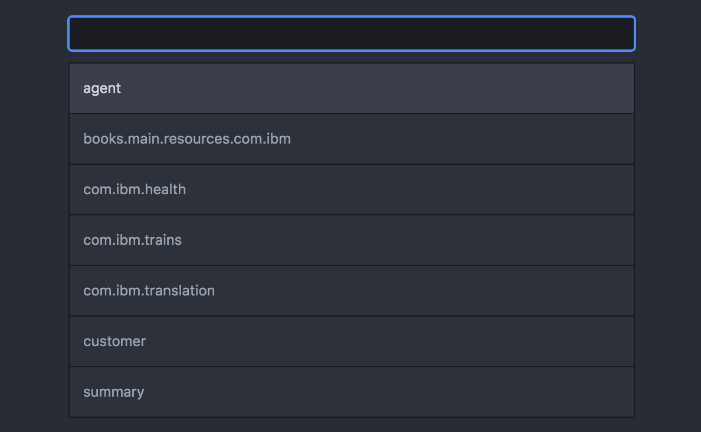
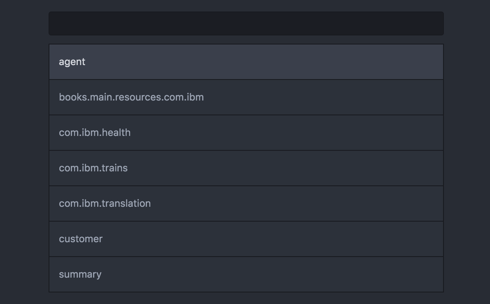

# gp-atom package

This extension enables you to quickly create, upload, download, and delete translation bundles in the Globalization Pipeline service on IBM Bluemix.
If you are unfamiliar with IBM Bluemix and the Globalization Pipeline service checkout these links:

+ [Bluemix](https://bluemix.net)
- [Globalization Pipeline](https://console.ng.bluemix.net/docs/services/GlobalizationPipeline/index.html)

## Features

You can create a new bundle right from the editor without having to use the Globalization Pipeline service's dashboard.


You can upload your content from the editor and the extension will automatically get all your available bundles.



You can download your bundles from the editor and then select the language that you want.



## Install

You can install the Globalization Pipeline extension by searching for `gp-atom` in Settings > Install > Packages. Or install it directly using the command:

```shell
apm install gp-atom
```

## Requirements

You must first [create an instance of the Globalization Pipeline service on Bluemix](https://github.com/IBM-Bluemix/gp-common#quick-start-guide) before you can use this extension to work with translation bundles.

## Extension Settings

To use the package copy over your VCAP credential settings for the Globalization Pipeline service and fill in the appropriate fields.

This package contributes the following settings:

* `userId`: The Globalization Pipeleine service userId
* `password`: The Globalization Piepeline service password
* `instanceId`: The Globalization Pipeline service instanceId
* `url`: The Globalization Pipeline service url end point
* `sourceLanguage`: The source language of the content that you will upload to the service, e.g. *en*, must be a valid BCP 47 language code. By default this value is set to *en*
* `targetLanguages`: An array of target lanaguges that your bundle will be translated into, e.g., *es, fr*, must be valid BCP 47 language codes

## Usage

From Packages select Globalization Pipeline you should see the following commands:

+ Globalization Pipeline - Create Bundle
+ Globalization Pipeline - Delete Bundle
+ Globalization Pipeline - Download Bundle
+ Globalization Pipeline - Upload Source Bundle

When you use these commands a connection will automatically be made to the Globalization Pipeline service on IBM Bluemix to complete your requested action.
When you upload your source bundle content the extension will automatically detect the file format and will perform any necessary transformation for you.
Currently only Java properties, JSON, Gettext POT, and i18n AMD resource bundles are supported. To upload bundle content make sure the content is being displayed in the active
edit screen and then invoke the extension.

## Accessing bundles

The best way to access the bundles from your application is to use one of the Globalization Pipeline's programming language SDKs.
Many programming languages such as: Java, Node.js, Angular, and Python are supported. You can find a complete list of the SDKs [here](https://github.com/IBM-Bluemix/gp-common)
You can also download a bundle in json format.

## License

Apache 2.0. See [LICENSE.txt](LICENSE.txt)

> Licensed under the Apache License, Version 2.0 (the "License");
> you may not use this file except in compliance with the License.
> You may obtain a copy of the License at
>
> http://www.apache.org/licenses/LICENSE-2.0
>
> Unless required by applicable law or agreed to in writing, software
> distributed under the License is distributed on an "AS IS" BASIS,
> WITHOUT WARRANTIES OR CONDITIONS OF ANY KIND, either express or implied.
> See the License for the specific language governing permissions and
> limitations under the License.
